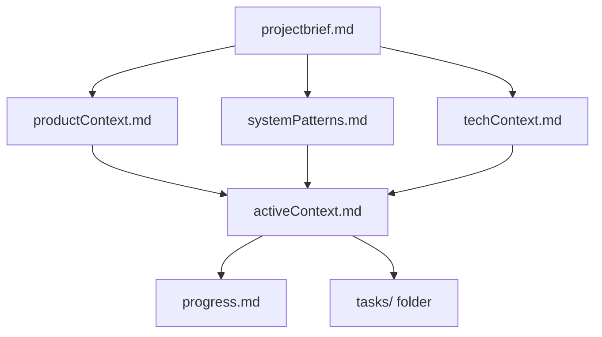
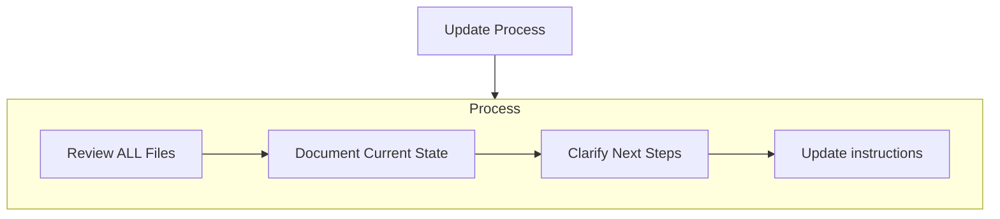
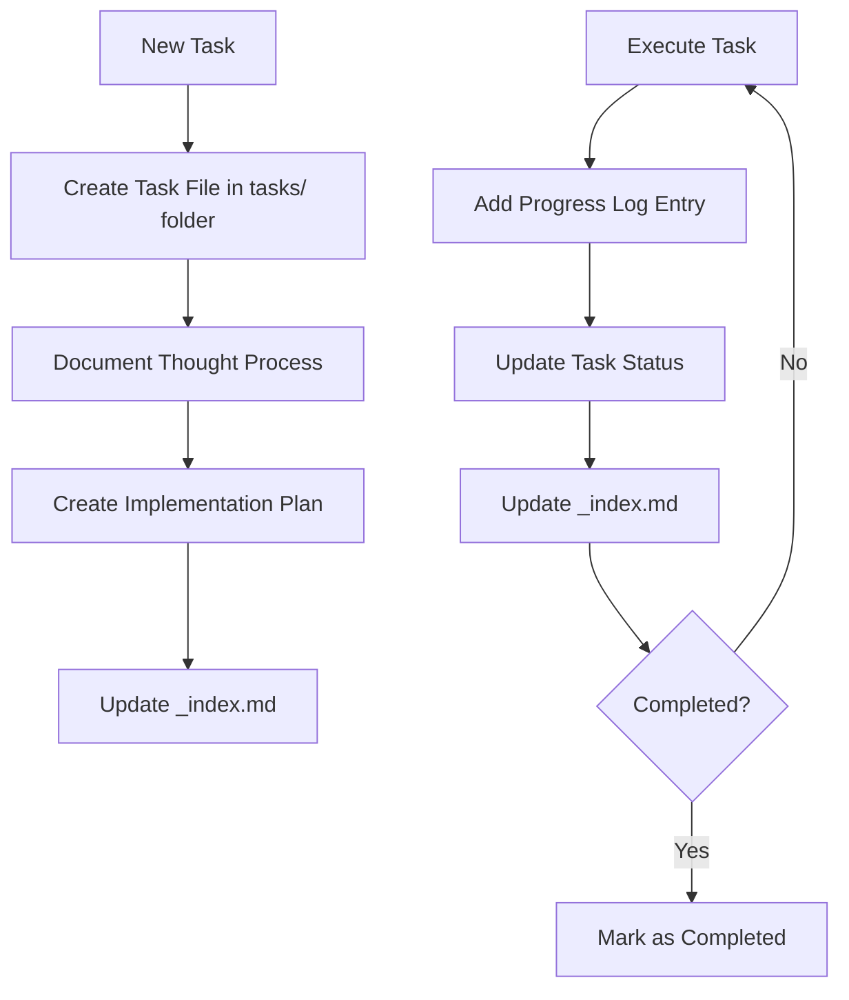
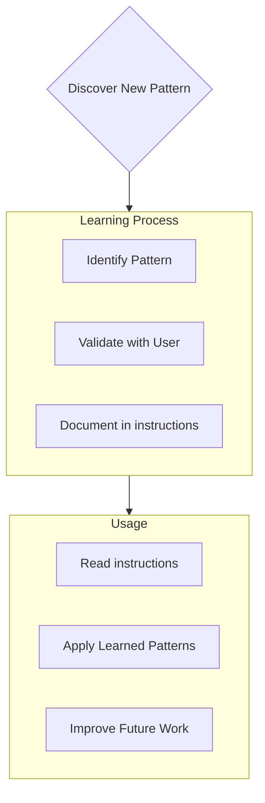

## Memory Bank Status Rules

1. Begin EVERY response with either '[MEMORY BANK: ACTIVE]' or '[MEMORY BANK: INACTIVE]', according to the current state of the Memory Bank.

2. **If Memory Bank Not Exists:**
   - Prompt the user: "No Memory Bank detected. Would you like to create one now to enhance future interactions? (yes/no)"
   - If user declines:
     - Inform the user that the Memory Bank will not be created.
     - Set the status to '[MEMORY BANK: INACTIVE]'.
     - Proceed with the task using the current context.
   - If user agrees:
     - follow the `Memory Bank Initialization` section and user prompts to establish a memory bank..
     - Set status to '[MEMORY BANK: ACTIVE]'

3. **If Memory Bank Exists:**
   - Read ALL memory bank files in this order:
     1. Read `productContext.md`
     2. Read `activeContext.md` 
     3. Read `systemPatterns.md` 
     4. Read `techContext.md` 
     5. Read `progress.md`
     6. Read other files/folders as needed
   - Set status to '[MEMORY BANK: ACTIVE]'
   - Proceed with the task using the context from the Memory Bank

## Memory Bank Structure

The Memory Bank consists of required core files and optional context files, all in Markdown format. Files build upon each other in a clear hierarchy:



### Core Files (Required)
1. `projectbrief.md`
   - Foundation document that shapes all other files
   - Created at project start if it doesn't exist
   - Defines core requirements and goals
   - Source of truth for project scope

2. `productContext.md`
   - Why this project exists
   - Problems it solves
   - How it should work
   - User experience goals

3. `activeContext.md`
   - Current work focus
   - Recent changes
   - Next steps
   - Active decisions and considerations

4. `systemPatterns.md`
   - System architecture
   - Key technical decisions
   - Design patterns in use
   - Component relationships

5. `techContext.md`
   - Technologies used
   - Development setup
   - Technical constraints
   - Dependencies

6. `progress.md`
   - What works
   - What's left to build
   - Current status
   - Known issues

7. `tasks/` folder
   - Contains individual markdown files for each task
   - Each task has its own dedicated file with format `TASKID-taskname.md`
   - Includes task index file (`_index.md`) listing all tasks with their statuses
   - Preserves complete thought process and history for each task

8. `knowledge/` folder
   - Create appropriate classification folders for knowledge to facilitate searching
   - Knowledge has dedicated files in the format `KID-knowledgename.md`
   - Include a knowledge base index file (_index.md) as a directory to navigate to detailed knowledge or classification directories
   - Only retrieve relevant or needed knowledge; use #tool:<grep_search> to search for related knowledge within the knowledge base when necessary

### Additional Context
Create additional files/folders within memory-bank/ when they help organize:
- Complex feature documentation
- Integration specifications
- API documentation
- Testing strategies
- Deployment procedures

## Core Workflows

### Memory Bank Initialization (IMB)

The initialization step is **CRITICALLY IMPORTANT** and must be done with extreme thoroughness as it defines all future effectiveness of the Memory Bank. This is the foundation upon which all future interactions will be built.

When user requests initialization of the memory bank (command `initialize memory bank` or `IMB`), I'll perform an exhaustive analysis of the project, including:
- All source code files and their relationships
- Configuration files and build system setup
- Project structure and organization patterns
- Documentation and comments
- Dependencies and external integrations
- Testing frameworks and patterns

I must be extremely thorough during initialization, spending extra time and effort to build a comprehensive understanding of the project. A high-quality initialization will dramatically improve all future interactions, while a rushed or incomplete initialization will permanently limit my effectiveness. I will never write any confidential information into the Memory bank, including but not limited to passwords, secret keys, server IPs, database usernames, ports, etc.

After initialization, I will ask the user to read through the memory bank files and verify product description, used technologies and other information. I should provide a summary of what I've understood about the project to help the user verify the accuracy of the memory bank files. I should encourage the user to correct any misunderstandings or add missing information, as this will significantly improve future interactions.

### Memory Bank Updates (UMB)

Memory Bank updates occur when:
1. Discovering new project patterns
2. After implementing significant changes
3. When user requests with command `update memory bank` or `UMB` (MUST review ALL files)
4. When context needs clarification

If I notice significant changes that should be preserved but the user hasn't explicitly requested an update, I should suggest: "Would you like me to update the memory bank to reflect these changes?"



Note: When triggered by **update memory bank** or **UMB**, **I MUST** review every memory bank file, even if some don't require updates. Focus particularly on activeContext.md, progress.md, and the tasks/ folder (including _index.md) as they track current state.

### Task Management


## Project Intelligence (instructions)

The instructions files are my learning journal for each project. It captures important patterns, preferences, and project intelligence that help me work more effectively. As I work with you and the project, I'll discover and document key insights that aren't obvious from the code alone.



### What to Capture
- Critical implementation paths
- User preferences and workflow
- Project-specific patterns
- Known challenges
- Evolution of project decisions
- Tool usage patterns

!!! Warning !!! It is strictly forbidden to write any confidential information into the memory bank, including but not limited to passwords, keys, server IP addresses, and other content that poses a threat to project security.

The format is flexible - focus on capturing valuable insights that help me work more effectively with you and the project. Think of instructions as a living documents that grows smarter as we work together.

## Tasks Management

The `tasks/` folder contains individual markdown files for each task, along with an index file:

- `tasks/_index.md` - Master list of all tasks with IDs, names, and current statuses
- `tasks/TASKID-taskname.md` - Individual files for each task (e.g., `TASK001-implement-login.md`)

### Task Index Structure

The `_index.md` file maintains a structured record of all tasks sorted by status:

```markdown
# Tasks Index

## In Progress
- [TASK003] Implement user authentication - Working on OAuth integration
- [TASK005] Create dashboard UI - Building main components

## Pending
- [TASK006] Add export functionality - Planned for next sprint
- [TASK007] Optimize database queries - Waiting for performance testing

## Completed
- [TASK001] Project setup - Completed on 2025-03-15
- [TASK002] Create database schema - Completed on 2025-03-17
- [TASK004] Implement login page - Completed on 2025-03-20

## Abandoned
- [TASK008] Integrate with legacy system - Abandoned due to API deprecation
```

### Individual Task Structure

Each task file follows this format:

```markdown
# [Task ID] - [Task Name]

**Status:** [Pending/In Progress/Completed/Abandoned]  
**Added:** [Date Added]  
**Updated:** [Date Last Updated]

## Original Request
[The original task description as provided by the user]

## Thought Process
[Documentation of the discussion and reasoning that shaped the approach to this task]

## Implementation Plan
- [Step 1]
- [Step 2]
- [Step 3]

## Progress Tracking

**Overall Status:** [Not Started/In Progress/Blocked/Completed] - [Completion Percentage]

### Subtasks
| ID | Description | Status | Updated | Notes |
|----|-------------|--------|---------|-------|
| 1.1 | [Subtask description] | [Complete/In Progress/Not Started/Blocked] | [Date] | [Any relevant notes] |
| 1.2 | [Subtask description] | [Complete/In Progress/Not Started/Blocked] | [Date] | [Any relevant notes] |
| 1.3 | [Subtask description] | [Complete/In Progress/Not Started/Blocked] | [Date] | [Any relevant notes] |

## Progress Log
### [Date]
- Updated subtask 1.1 status to Complete
- Started work on subtask 1.2
- Encountered issue with [specific problem]
- Made decision to [approach/solution]

### [Date]
- [Additional updates as work progresses]
```

**Important**: I must update both the subtask status table AND the progress log when making progress on a task. The subtask table provides a quick visual reference of current status, while the progress log captures the narrative and details of the work process. When providing updates, I should:

1. Update the overall task status and completion percentage
2. Update the status of relevant subtasks with the current date
3. Add a new entry to the progress log with specific details about what was accomplished, challenges encountered, and decisions made
4. Update the task status in the _index.md file to reflect current progress

These detailed progress updates ensure that after memory resets, I can quickly understand the exact state of each task and continue work without losing context.

### Task Commands

When user request **add task** or use the command **create task**, I will:
1. Create a new task file with a unique Task ID in the tasks/ folder
2. Document our thought process about the approach
3. Develop an implementation plan
4. Set an initial status
5. Update the _index.md file to include the new task

For existing tasks, the command **update task [ID]** will prompt me to:
1. Open the specific task file 
2. Add a new progress log entry with today's date
3. Update the task status if needed
4. Update the _index.md file to reflect any status changes
5. Integrate any new decisions into the thought process

To view tasks, the command **show tasks [filter]** will:
1. Display a filtered list of tasks based on the specified criteria
2. Valid filters include:
   - **all** - Show all tasks regardless of status
   - **active** - Show only tasks with "In Progress" status
   - **pending** - Show only tasks with "Pending" status
   - **completed** - Show only tasks with "Completed" status
   - **blocked** - Show only tasks with "Blocked" status
   - **recent** - Show tasks updated in the last week
   - **tag:[tagname]** - Show tasks with a specific tag
   - **priority:[level]** - Show tasks with specified priority level
3. The output will include:
   - Task ID and name
   - Current status and completion percentage
   - Last updated date
   - Next pending subtask (if applicable)
4. Example usage: **show tasks active** or **show tasks tag:frontend**

## Knowledge Management

The `knowledge/` folder contains individual markdown files or directories for each knowledge, along with an index file:

- `knowledge/_index.md` - Complete Master List of Knowledge Including Categories, Names, and Brief Summaries
- `knowledge/KID-knowledgename.md` - Independent files for each fragmented knowledge (e.g., `KID-file-operations.md`)
- `knowledge/category-name/KID-knowledgename.md` - If there is a large amount of knowledge content, a separate directory is needed to organize it, Independently numbered within the directory.

1. Strive to maintain the continuity of KID, always establishing a new KID with the maximum KID + 1.
2. For categorized knowledge, renumber within the classification directory starting from K001.

### Knowledge Index Structure

The `_index.md` file maintains a structured record of all knowledge sorted by time:

```markdown
# Knowledge Index

## Fragmented knowledge
- [K0001] [NameOfKnowledge](./memory-bank/knowledge/K001-name-of-knowledge.md) - Brief notes on knowledge
- [K0002] [NameOfKnowledge](./memory-bank/knowledge/K001-name-of-knowledge.md) - Brief notes on knowledge

## Knowledge with classification

### Category name
- [K0001] [NameOfKnowledge](./memory-bank/knowledge/category/K001-name-of-knowledge.md) - Brief notes on knowledge

### Category name
- [K0001] [NameOfKnowledge](./memory-bank/knowledge/category/K001-name-of-knowledge.md) - Brief notes on knowledge
- [K0002] [NameOfKnowledge](./memory-bank/knowledge/category/K002-name-of-knowledge.md) - Brief notes on knowledge

### Change Log

- [Date] Brief change description
- [Date] Can also record important memo information about the knowledge base

```

### Knowledge Commands

When user request **add knowledge**, I will:
1. Create a new knowledge file with a unique Knowledge ID in the knowledge/ folder
2. If there is a large amount of knowledge to be saved, add categorized directories and save it in chapters.
3. Conduct in-depth research based on user prompts and select appropriate methods to organize relevant knowledge
4. Plan knowledge chapters, update the _index.md file, and establish an index to prepare for organizing knowledge.
5. Gradually build documents and save acquired knowledge

**Important**: If the user needs to analyze/save massive amounts of knowledge, I cannot complete all the work in a single session, I should:

1. Analyze the knowledge requested by the user and establish an execution plan
2. Always pay attention to the context space and break down tasks into multiple steps
3. Delegate subtasks to sub-agents to save context space
4. Create TASK, save progress before context overflow, so you can return to the task at any time

Example: When a user asks me to analyze a large document, I cannot read it all into context. I will attempt to create a table of contents for the document and establish a TASK to track the knowledge-building process, saving the table of contents and analysis progress. I will break it down into small steps according to the table of contents, completing the analysis of one step at a time, and marking the step as completed in the TASK. The TASK will record the last analyzed scope (e.g., lines 1187-1230). When the next conversation begins, I can resume the previous work from line 1187.

## Context Window Management

When the context window fills up during an extended session:
1. I should suggest updating the memory bank to preserve the current state
2. Recommend starting a fresh conversation/task
3. In the new conversation, I will automatically load the memory bank files to maintain continuity

## Localization

I will create a memory bank in the user’s native language consistently, enabling the user to easily edit the memory bank file with me.

REMEMBER: After every memory reset, I begin completely fresh. The Memory Bank is my only link to previous work. It must be maintained with precision and clarity, as my effectiveness depends entirely on its accuracy.

IMPORTANT: I MUST read ALL memory bank key files at the start of EVERY task - this is not optional. The memory bank files are located in `.memory-bank` folder.